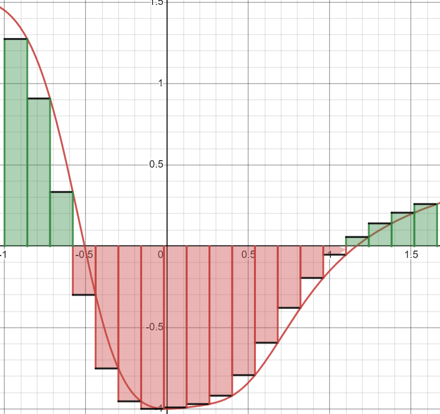

# PID - Week 3

PID is the controller we use for a lot of the systems on our robot. The main concept for a [PID controller](https://en.wikipedia.org/wiki/Proportional–integral–derivative_controller) is to take a desired value and an actual value, and minimize the difference between the two, which is referred to as "error". When the error is near zero then you have succesfully reached the setpoint. PID does this with three components, the Proportional component, the Integral component, and the Derivative component.

This is the underlying equation behind PID, and over the course of this week we will be teaching you what each component means

$u(t) = K_p\cdot e(t) + K_i\cdot\int^t_0{e(\tau)d\tau}~+ K_d\cdot \frac{d}{dt}\left[e\left(t\right)\right]$

*where e(t) is the error at time t, and u(t) is the output of the PID controller. In our case, when working with motors, u(t) will always be the power we give them*.

Effectively, we have a controller for a single action, so that aspect is tuned to use. We have individually tuned PIDs for the position and velocity of each motor, because each motor is in a unique position on the robot, with different load, friction, and other random qualities.

Before you read the rest of this, you should watch this video: [Embedded Training - PID](https://youtu.be/yVpCXCNAQF0). The script for this video can be found in the [video_script_pid_lecture.md](video_script_pid_lecture.md)

### Proportional

The first section of the PID Formula is proportional, P. The output here is simply directly proportional to the error.
An example scenario: We have a PID controller for a motor's position with values of {3.2, 0, 0}, so it only has P. We want the position to be at 40 ticks, but we are currently at 30 ticks. In this situation, our error is 10. The equation now looks as such.

$u(t) = K_p\cdot e(t)\to u(t) = 3.2(10) = 32$

The I and D components are simply ignored, because their weight coefficients are set to 0. In a situation when we are only using P, we get an output directly proportional to the error, 32.
The P component is for quick temporary bursts, and it will often be the first thing you attempt to tune.

### Integral

The second section of the PID Formula is integral, I. The output here is the integral of the error. Lets consider an example where the PID controller has values {0, 2.1, 0}. Here is a potential error vs time graph

Lets imagine we are now at 3.4 seconds, and the total integral of everything prior is -1.65. Our equation now looks like this.

$u(t) = K_i\cdot\int^t_0{e(\tau)d\tau} \to u(t) = 2.1(-1.65) = -3.465$

Now, due purely to integral, our output value is -3.465.
The integral is meant to be more persistent, as if the error is zero, integral will not shift, and the output from the integral component will be relatively stable. Often, we tune integral with both its coefficient and a max value, so that we don't have an integral that compounds into infinity.

### Derivative

The final aspect of PID is derivative. The output here is based upon the derivative of error. Lets consider an example where the PID controller has values {0, 0, 4.2} (Terrible values in practice).

Lets look at the same error vs time graph from before, except this time we are at 2.6 seconds.

Now, we are at 2.6 seconds, observe the green line. The slope of that green line is the derivative of the error at 2.6 seconds, which is 2.48. This is what the derivative section of the equation looks like now.

$u(t) = K_d\cdot \frac{d}{dt}\left[e\left(t\right)\right] \to u(t) = 4.2(2.48) = 10.416$

The derivative has set our output to be 10.416. Derivative is meant to dampen a PID controller. If the error is moving toward zero, the derivative will add a component to make the error grow, and if the error is growing its component will make it move toward zero. It effectively dampens change.

### Integral Calculation

If you've taken calc, you probably know about Riemann (Ree-mon) sums. Riemann sums are how we calculate integrals in code. While data in the real world is fluid, code is not, code, however, can get pretty close if the time interval is small enough. What we get from this is a series of points that describe the curve.

Imagine this is a graph of error. What we are showing here is a Right-Hand Riemann sum. This is how we recommend you implement integral calculations (as its pretty simple), but you can do it in other ways. You can experiment with this data set here: [Rieman Sum Simulator](https://www.desmos.com/calculator/kye17rgo1b)

### Derivative Calculations

The way we do derivatives is also the same way we do derivative in calc. A derivative is the slope between two points, where the dt is a limit to infinity. In our case, with code, the dt is simply as fast as we get data, which gets us pretty close. If you'd like to experiment with how the dt changes the results, I have another desmos sim here: [Derivatives Approximation](https://www.desmos.com/calculator/yhwf0jrps8). It uses the same data as the integral sim.

Between each data point, you see the yellow slope line and the two blue component lines. for PID, we consider the dE at each point as the slope of the line leading to it. The dE at the green marked point would be the slope between the two marked points.

# Assignment #1 - Writing the class

For this exercise, we'll be writing a PID class. There is some starter code, which you can find in [week3_assignment1.cpp](https://github.com/Triton-Robotics-Training/Embedded-Week-3/blob/main/week3_assignment1.cpp), but you'll be implementing the things you've learned above yourself. You have full freedom to change anything in the PID class sectionc, but not the main section, as thats the autograder. Of course you can add prints in the main as you'd like, and modify the debug flag in main. We have a set of [known correct outputs](pidCorrectOutputs.md), which is helpful for debugging, but know that differences from these do not necessarily mean that you are incorrect.

# Additional Notes

### Tuning the PID Parameters (Kp, Ki, Kd)

Tuning the PID coefficients can be a trial-and-error process. Finding the right balance between the three is crucial, as improper tuning can lead to instability, oscillations, or slow responses. Common methods for tuning PID includes the Ziegler-Nochols method or manual tuning stategies

# Assignment #2 - Tuning

For the second assignment this week we will be using a custom PID Simulator ([Sim](https://pknessness.github.io/pid_sim/pid.html)). There will a list of objectives in the week 3 assignment 2 [text file](week3_assignment2.txt). For which you have to tune to the instructions and input the answer within the file. 

Clicking the "Test Sequence" button will begin a test set and you will be able to see how your PIDs fare to a predetermined set of moves. It will tell you the worst stabilization time and the worst overshoot amount. Keep in mind that if your tunings don't stabilize, it will say so. If you have any questions about the simulator, please contact your lead.

If you're having trouble with tuning, you can refer back to the video at the start, the [PID Lecture](https://youtu.be/yVpCXCNAQF0)
