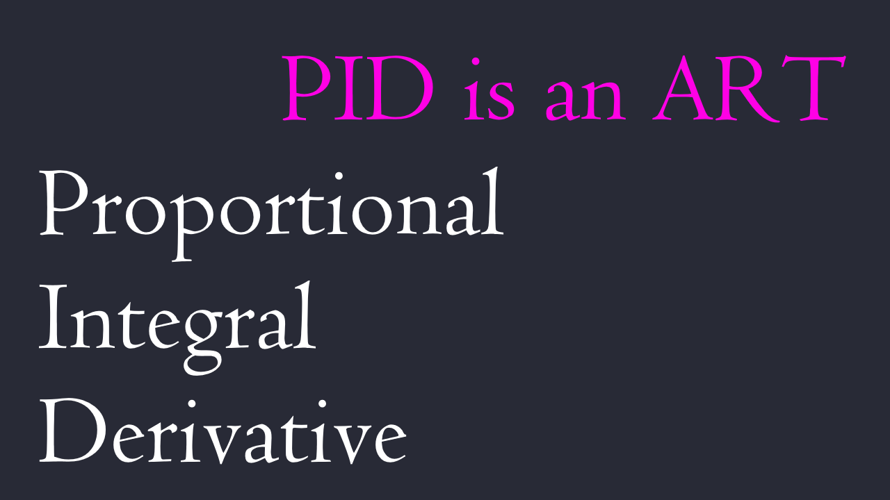
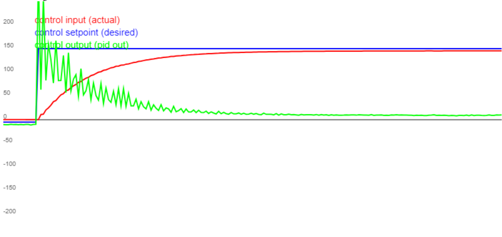

> TITLE CARD: PID ↓
> 

This is Week 3's PID video:

In this video we're going over PID.

> Intro Card ↓
> 

PID is an algorithm, and tuning PID is an art.

As an engineer, the actual movements of any system is rarely the same as we want. We need some ways to control the state of the system so that it is as close as possible to how we want. PID is an algorithm that allows us to adjust our actuation to push our actual state to our desired state given the system's previous behaviors, allowing us to control systems where our method of actuation is not directly controlling the state of the machine that we want controlled.

PID stands for Proportional, Integral, Derivative, and it names the three components that we use to control our system. We will go more into depth on this over the course of this video.

An example that we'll be using for the rest of this video is a motor where we control its power (acceleration) and we want to control its position.

> TERMINOLOGY CARD, ALL THE TERMS ↓
> 

Before we delve into the specifics of PID, here are some terminologies:

The desired state is where we want the system to be. It is also known as the setpoint. We can refer to this as s(t)

The actual state is where the system is, this is gotten through a sensor of some kind. PID is a closed-loop system. A closed loop-system uses feedback of a measurement of some kind, while an open loop system, you control your actuation and then pray that its where you want it to be and ball. We can say this is a(t)

The error of the system is the desired minus actual. This is how far the actual state of the system is deviated from the desired. We will refer to this as $e(t)$

The output is how we actuate on, or change the system. It's the value you send out of the PID and into the motor or other actuation device to act on the system. This is generally our only method of impacting the system, and is often not relatable to the inputs we get from the system, an example being that we want to control position of a motor but all we can actually set is its acceleration. We will refer to this as $u(t)$

Remember that PID is an algorithm that helps us control the variable we care about with actuation that doesn't directly correlate to the states we want. For example, a lot of our motors only give us access to acceleration, and what we want to do instead is control position.

In this lecture, I'll be using a lot of examples and showing a lot of models, all of these can be found here at [https://pknessness.github.io/pid_sim/pid.html](https://pknessness.github.io/pid_sim/pid.html)

> BANG BANG ↓
> 

Before we even go into PID, lets consider first a simple scenario and control system, we have a motor, a desired position (pictured in blue), and we know the actual position (red). Our output, sent to the motor, is in green. We can give the motor either full power, nothing, or full reverse power.

The simplest form of control is known as Bang Bang control. If we are above the actual, we give the motor full power downwards, and if we are below the actual, we give the motor full power upwards. This is what you'll get from that sort of control most if not all of the time, where delays in reaction and inertia in the system cause the jagged motion of the actual around the desired.

This is a rudimentary form of control, and is mainly used when you have no fine control over actuation, and don't really care about smooth stable movement, and instead have a binary ON or OFF for your motor or other device.

> INCLUDE P EQUATION PLUS A DIAGRAM? A VISUAL? OF SOME SORT IDK ↓

If we have variable control over our actuation, a better way we can make a system do what we want is with a proportional component. Proportional is the P in PID. A proportional component will set an output directly proportional to the error, as such $u_p(t) = k_p * e(t)$. In this case, the constant $k_p$ is our multiplier for p, and it is one of the parameters we use to tune the system. We can consider $u_p$ as JUST the proportional component of $u(t)$, and if you remember, $u(t)$ is the output.

Let's take an example of a motor, with which we are trying to control its position. Let's say we have a motor at position -5, and we want to be at position 150, with this, our error e(t) is desired - actual, which is 150 - (-5), giving us an error of 155. If we have a $k_p$ value of 2, then the value that is sent the motor is 310. Around 50ms later, our motor is at 30, the $e(t)$ is around 120, and then our $u_p(t)$ equals around 240. Another 50ms later, we're at 100ms, our error is around 10, and then our $u_p(t)$ is 20. We can change the $k_p$ around to change how aggressively our PID will react to error.

These are all arbitrary units, and that makes sense because the scale of the PID depeends on the method of your measurment (what is -5 and what is 150, meters? cm? degrees?), and the method of actuation (What is 310, is that in amps, mA, percent, or some other unit). Remember that the scale of a PID will differ wildly on these factors.

> SHOW IMAGE1_2,0,0 ↓

Now, what if we apply 310 power to the motor, and it reached a position of 150. According to the equation, our desired is 150, our actual is 150, and therefore our error is 0 and our output is 0. Fantastic. HOWEVER, what if the system attached to the motor has inertia, and that inertia carries the motor past 150 and all the way to 277, before the force of the motor becomes enough to pull the system to a halt and make it begin moving in the other direction. Now its moving higher, until again it reaches 0 and the output is again 0 and then it goes past AGAIN to 55, and back, and forth, until it slowly stabilizes at 150. Here, you can see EXACTLY that happening. This exact model you can see in the pid_lecture_1_basic example in the [sim](https://pknessness.github.io/pid_sim/pid.html), which you can change using the "Process example" slider.

> SHOW EQUATION ↓
> 

This phenomenon is known as overshoot, and it happens with virtually any amount of unchecked inertia in your system. There is a way to combat this, and this comes in the form of the D component, or the derivative component. The derivative component will set an output directly proportional to the derivative of the error, as you can see here: $u_d(t) = k_d * \frac{de(t)}{dt}$. Remember $\frac{de(t)}{dt}$ is the derivative of error over time. ]

On its own, all it does is resist change of the actual, since if the actual is going away from the desired, the slope will point away from the desired and the D component will try to go towards the desired, and if the actual is going towards the desired, then the slope will point towards the desired and the D component will try to go away. Basically, the D component tries to maintain, and resists change. With both P and D, you can create systems that move the actual toward the desired and smooth out oscillations. If we go back to our scenario from earlier, lets say that we now have a $k_d$ of 2. Now, we should also quantify the derivative of the error. Lets say that the difference between the desired and actual is decreasing at a rate of -60. That is our de/dt, and therefore our d component becomes -120. This plus the 310 will reduce to 190 and this will slow the motor, and will continue to keep it at a slower rate as it reaches the desired position.

> SHOW IMAGE2_2,0,2 ↓
> 

You can see this happening here. The only difference between this and the previous graph is that the previous graph had PID 2 0 0, (P is 2, I is 0, D is 0), and this new one has a PID of 2 0 2, (both P and D are 2, I is 0). I recommend going to the sim and playing around with the pid_lecture_1_basic example until you can make it smooth. Move the setpoint around to see how it reacts.

You can see how smooth the transition is, and how much better and more quickly the actual reaches the desired. Look at this, its FANTASTIC. Keep in mind however, that raising the D too high can cause a very slow reaction, because the dampening is going too far, and beyond a certain point it will cause very high frequency oscillation. I recommend you try this in the sim, and move the setpoint around.

In a more general sense, as you approach the setpoint quickly, your $u_d$ will become larger and continue opposing your motion, while your $u_p$ will shrink (because you are growing nearer to your setpoint), until you reach your setpoint. If you are moving quickly, the $u_d$ will oppose your motion more, and if you are near the setpoint, the $u_p$ will try less hard to get there. It is a combination of these two components that causes this smooth motion as a result.

> IMAGE3 ↓
> 

Now we've looked at when you want to use P and when you want to use D, but we've skipped I, and thats because its a rather difficult one to use, its so finnicky and it hates you all the time but sometimes you need it.

Let's consider a second scenario where there is a high amount of friction on the device. With both P and D, the motor is able to get close to the desired position, but the friction is too much to overcome, and increasing the P too much will simply make it overshoot. In this case, we want to use a little bit of I.

I follows the following equation: $u_i(t) = k_i * \int{e(t)dt}$. It grows with the integral of the error OVER TIME, what we're looking at is the area under the curve, so it grows exponentially and often very uncontrollably. Often in this case, we want to add a cap to how large the I component can build to. Now, lets see it in use.

This example is the pid_lecture_2_friction example, which can be accessed in the same way as the first.

> IMAGE4 ↓
> 

Consider now this graph that is the same physical characteristics, now with a 2 1 2 PID. See how this causes overshoot again. This is because when the setpoint changed, the error began to accumulate as integral.

> IMAGE4.1 ↓
> 

The area under the curve before the actual and desired met is accumulated without limit as integral, pictured here in pink, and then begins to impact the system beyond crossing the setpoint because the integral has "wound up" and needs to unwind, the unwinding pictured here in orange, before the integral component is 0. Remember that the $u_i$ is equal to $k_i$ times the integral, the integral being the area under the curve. Sometimes you want this to be the case, but here it winds up too much. One way we can reduce this is by reducing the $k_i$ coefficient, but this will lead to an even more delayed reaction because the integral component will simply wind up less quickly.

What we need is to limit the I component's winding up, and we can do that using the fourth parameter, the I cap. The I cap is the maximum of the I component of the entire equation, basically limiting how much the I component can build to, and overall how much of an impact it can have on the final output. In mathmatical terms, it is $u_i(t) = min(Icap,k_i * \int{e(t)dt})$.When using I cap, $k_i$ becomes a parameter of "how fast does the I build", basically becoming a persistent parameter that will decrease continuously (until it reached the I cap) when actual is above desired, and increase continuously (until it reached the I cap) when actual is below desired.

> IMAGE5 ↓
> 

Now we're running a 2 1 2 PID, and with an I cap of 15, on the same setup, and look how we're able to maintain a smooth transition into the end, and it reaches the setpoint.

Another way to deal with this could be to have a feed forward that applies a flat constant in whatever direction of movement to counteract specifically friction. We'll talk more about feed forwards and how we can use knowledge of the system to assist our PID later.

One final scenario where we want to use I is when we want a lot of power at the start, and then a small amount of power to maintain velocity, like a flywheel. Systems like a single motor and a flywheel have a moment of inertia that maintains velocity, and therefore will only need a small amount of power to counteract the energy leaving the system. You're still going to want to regulate the I cap so that the I component is sufficiently regulated.

> GRAPH SHOWING ACTUAL OUTPUT VS DESIRED ZOOMED IN SHOWING CONNECTION ↓
> 

One thing to note is that, it takes time for machines to interpret and execute the instructions in reality. Unlike our previous graphs which looks like they are continuous, the actual values are obtained and calculated in discrete time stamps, which you can see here. In this graph, we read and calculate new values every 10 ms. This means that we will need to use estimation methods to calculate the derivatives and integrals of e(t) for the following I and D components. We use riemann sums to approximate integrals and we use the point-slope formula to calculate derivatives, and we talk more about the theory of this in the README

> FULL EQUATION ↓
> 

Combining all three components, the PID equation is this:

$$
u(t) = k_pe(t) + k_i \int{e(t)dt} + k_d\frac{de(t)}{dt}
$$

And this is the base PID equation, taking into account only feedback that we get from the motor. PID at its heart is purely reactive, which means it can be adapted to any system, but it means that it is always lagging just a little bit behind. However, what if we know a characteristic about the system and we can use that to predict what we *should* give the motor.

> IMAGE WITH PITCH MOTOR AND FORCE DIAGRAM ↓
> 

Let's consider a theoretical scenario as such. We have a horizontal motor with a rod, and that rod has a non-negligible weight. A force of gravity is pulling down on the rod, and you can see that here in green as $F_g$.

Now, since the motor is a rotational pivot, we actually only care about the force thats tangent to the motor, because the rest of the force is just pushing into the motor, and the motor won't feel it at all. The force that the motor will feel is the force that is directly tangent to it. Looking at this force diagram, we can say that the amount of force pushing the motor clockwise is, pictured in yellow, $F_T$ . We can calculate this with trig, and this is equal to $F_g * cos(\theta)$.

The force is dependent on the angle of the motor, and wait, hold up. We have that. We know the angle of the motor, its data that we can access and we are currently using as the actual. All we need is to find how much "value" of the motor is equivalent to how much actuation of the motor.

To find this, we can set the motor to different values, and see how much it takes to keep it level at fully horizontal. Let say we do some testing, and we apply 40 to the motor and thats how much it takes to stay fully horizontal. We can simply set our feed forward to $40*cos(\theta)$, and with the knowledge that we currently have of the system, we don't have to do any unstable I to counteract gravity, we can use very stable known forces of the system, and then have the rest of the PID act as normal, which will be some P and some D.

This example is the pid_example_3_imbalanced in the sim, and I highly recommend taking a look at it, and attempting to tune it after removing the feed forward equation.

> CASCADING PID CONCEPT DIAGRAM ↓
> 

There is one final thing to discuss with PID, and that's using multiple PIDs for a single system. Often, we find difficulty in controlling a positional system when our method of actuation is acceleration, or torque. This is the case because acceleration is the double derivative of position, and with a lot of uneven forces in the mix, its often very difficult to run control on these. Controlling velocity with acceleration is much MUCH easier, and so is controlling position with velocity, which is why we can run one velocity PID to reliably control position with the motor's torque, and then a position PID that has its output go into the desired of the velocity PID. Inertia is better handled by a accel-controls-velocity PID than with a accel-controls-position PID, and a main reason for this is that inertia stabilizes velocity, and that unfortunately happens to make it more difficult to control position. Having a PID handle the accel and turn it into something more usable, velocity, makes the position PID a lot more stable, but it does mean you need to tune BOTH pids. 

That's something we'll talk about briefly in use, and that we plan to slowly incorporate more into the robot.

That's the end of this lecture. If you have any questions please ask your lead, they should be able to clear anything up. This also helps us improve our training program, as we may want to add the answers to your questions in this video in a later iteration.

# Writer's Notes:

TOPICS TO DISCUSS:

- What is PID? Why do we use it, what is the goal?
- First of all, terminology we should keep in track
- desired: where you want something to be (fixed color graph) (d(t))
- actual: where it is (another fixed color graph) a(t)
- error: `desired - actual` e(t)
- output: the value you give the motor? to make it do (the actuation), result of the current PID calculation u(t)
- time stamp: the time value used to distinguish between each cycle of code executed
- P component $ k_p $
- - proportional
- - reacts based on how far the desired is from the actual at the current time stamp
- I component
- - integral of the error
- - reacts in a cumulative fashion to the integral of error over time (slow build, will go up if the error is + and go down if the error is -)
- D component
- - differentiation
- - reacts based on the difference between the current and the previous time stamps (the slope), aka: how fast is the desired approaching the actual
- Feed forward
- - external equation or input to the output
- - can be set up to be based on external data or to be a static addition, or even a multiplier on the desired itself
- - very flexible, and is very diffeent from system to system
- - meant to react directly with knowledge you have about the system
- cascading PID (velo then pos)

EXAMPLES USING ALL COLLECTIVELY:
Flywheel P AND I
Turret Control (P D and FF )
