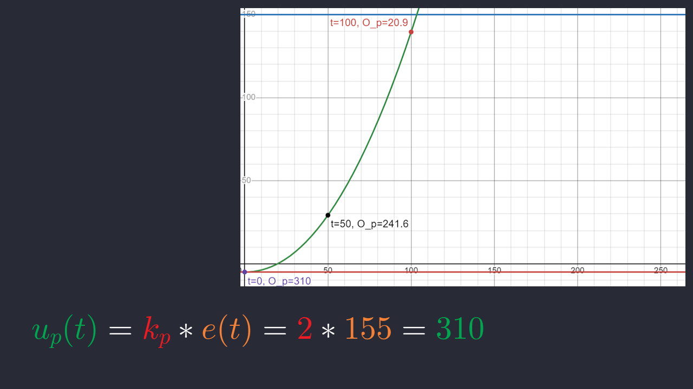

> TITLE CARD: PID ↓

This is Week 3's PID video:

In this video we're going over PID.

> IDK TODO (SHIRLEY PICK SMTH) ↓

PID is an art, but more realistically, PID is an algorithm (TODO)

As an engineer, the actual movements of any machine is rarely precisely the same as we desire. Thus, we need some ways to control the state of the machine so that it is as close as possible to how we want our machines to move. PID is an algorithm that allows us to adjust our actuation to our desired state given the machine's previous behaviors, allowing us to control systems where our method of actuation is not directly controlling the state of the machine that we want controlled.

An example that we'll be using for the rest of this video is a motor where we control its power (acceleration) and we want to control its position.

> TERMINOLOGY CARD, ALL THE TERMS ↓

Before we delve into the specifics of PID, here are some terminologies:

The desired state is where we want the system to be

The actual state is where the system is, this is gotten through a sensor of some kind (PID is closed-loop system, and thus requires feedback to operate).

The error of the system is the desired minus actual. This is how far the actual state of the system is deviated from the desired.

The output is how we actuate the system. This is generally our only method of actuating the system, and is often not relatable to the inputs we get from the system, an example being that we want to control position of a motor but all we can actually set is its acceleration.

Remember that PID is an algorithm that helps us control the variable we care about with separate actuation, and is used in cases where the only way we can actuate the system doesn't give us way to control the system well.

> INCLUDE P EQUATION PLUS A DIAGRAM? A VISUAL? OF SOME SORT IDK ↓

The first way we can make a system do what we want is with the proportional component. The proportional component will set an output directly proportional to the error, as such $u_p(t) = k_p * e(t)$. In this case, $k_p$ is our multiplier for p, and it is one of the parameters we use to tune the system.

Let's take an example of a motor, with which we are trying to control its position. Let's say we have a motor at position -5, and we want to be at 150, with this, our error e(t) is desired - actual, which is 150 - (-5), giving us an error of 155. If we have a $k_p$ value of 2, then the value that is sent the motor is 310.

These are all arbitrary units, and that makes sense because the scale of the PID depeends on the method of your measurment (what is -5 and what is 150, meters? cm? degrees?), and the method of actuation (What is 310, is that in amps, mA, percent, or some other unit). Remember that the scale of a PID will differ wildly on these factors.

> GRAPH SHOWING ACTUAL OUTPUT VS DESIRED ZOOMED IN SHOWING CONNECTION ↓

One thing to note is that, it takes time for machines to interpret and execute the instructions in reality. Unlike our previous graphs which looks like they are continuous, the actual values are obtained and calculated in discrete time stamps, which you can see here. In this graph, we read and calculate new values every 10 ms. This means that we will need to use estimation methods to calculate the derivatives and integrals of e(t) for the following I and D componenets. We use riemann sums to approximate integrals and we use the point-slope formula to calculate derivatives.

> SHOW IMAGE1_2,0,0 ↓

Now, what if we apply 310 power to the motor, and it reached 150. According to the equation, our desired is 150, our actual is 150, and therefore our error is 0 and our output is 0. Fantastic. HOWEVER, what if the system attached to the motor has inertia, and that inertia carries the motor past 150 and all the way to 277, before the force of the motor becomes enough to pull the system to a halt and make it begin moving in the other direction. Now its moving higher, until again it reaches 0 and the output is again 0 and then it goes past AGAIN to 55, and back, and forth, until it slowly stabilizes at 150. Here, you can see EXACTLY that happening.

> SHOW EQUATION ↓

This phenomenon is known as overshoot, and it happens with virtually any amount of unchecked inertia in your system. There is a way to combat this, and this comes in the form of the D component, or the derivative component. The derivative component will set an output directly proportional to the error, as such $u_d(t) = k_d * \frac{de(t)}{dt}$. On its own, all it does is resist change of the actual, but with P and D, you can create systems that move the actual toward the desired and smooth out oscillations. If we go back to our scenario from earlier, lets say that we now have a $k_d$ of 2. Now, we should also quantify the derivative of the error. Lets say that the difference between the desired and actual is decreasing at a rate of -60. That is our de/dt, and therefore our d component becomes -120. This plus the 310 will reduce to 190 and this will slow the motor, and will continue to keep it at a slower rate as it reaches the desired position.

> SHOW IMAGE2_2,0,2 ↓

You can see this happening here. The only difference between this and the previous graph is that the previous graph had PID 2 0 0, (P is 2, I is 0, D is 0), and this new one has a PID of 2 0 2, (both P and D are 2, I is 0).

You can see how smooth the transition is, and how much better and more quickly the actual reaches the desired. Look at this, its FANTASTIC.

> IMAGE3 ↓

Now we've looked at when you want to use P and when you want to use D, but we've skipped I, and thats because its a rather difficult one to use, its so finnicky and it hates you all the time but sometimes you need it.

Let's consider a second scenario where there is a high amount of friction on the device. With both P and D, the motor is able to get close to the desired position, but the friction is too much to overcome, and increasing the P too much will simply make it overshoot. In this case, we want to use a little bit of I.

I follows the following equation: $u_i(t) = k_i * \int{e(t)dt}$. It grows with the integral of the error OVER TIME, what we're looking at is the area under the curve, so it grows exponentially and often very uncontrollably. Often in this case, we want to add a cap to how large the I component can build to. Now, lets see it in use.

> IMAGE4 ↓

Consider now this graph that is the same physical characteristics, now with a 2 1 2 PID. See how this causes overshoot again. We need to seriously reduce the I, and increasing the P and D a bit wouldn't hurt either.

> IMAGE5 ↓

Now we're running a 3 0.1 2.5 PID, on the same setup, and look how we're able to maintain a smooth transition into the end, and it reaches the setpoint. Unfortunately its not perfect, but increasing the I any more will seriously unstabilize the system. In these types of cases, it may be best to look at why there is so much friction in the system and see if that can be dealt with.

Another way to deal with this could be to have a feed forward that applies a flat constant in whatever direction of movement to counteract specifically friction. This is not something you'll have to do for

One final scenario where we want to use I is when we want a lot of power at the start, and then a small amount of power to maintain velocity, like a flywheel. Systems like a single motor and a flywheel have a moment of inertia that maintains velocity, and therefore will only need a small amount of power to counteract the energy leaving the system.

> FULL EQUATION ↓

Combining all three components, the PID equation is this:

$$
u(t) = k_pe(t) + k_i \int{e(t)dt} + k_d\frac{de(t)}{dt}
$$

And this is the base PID equation, taking into account only feedback that we get from the motor. PID at its heart is purely reactive, which means it can be adapted to any system, but it means that it is always lagging just a little bit behind. However, what if we know a characteristic about the system and we can use that to predict what we *should* give the motor.

> IMAGE WITH PITCH MOTOR AND FORCE DIAGRAM ↓

Let's take into account a theoretical scenario as such. We have a horizontal motor with a rod, and that rod has a non-negligible weight. A force of gravity is pulling down on the rod, and you can see that here.

Now, since the motor is a rotational pivot, we actually only care about the force thats tangent to the motor. Looking at this force diagram, we can say that the amount of force pushing the motor clockwise is $F_T$ or $F_g * cos(\theta)$.

The force is dependent on the angle of the motor, and wait, hold up. We have that. We know the angle of the motor, its the actual. All we need is to find how much "force" of the motor is equivalent to how much actuation of the motor.

To find this, we can set the motor to different values, and see how much it takes to keep it level at fully horizontal. Let say we do some testing, and we apply 40 to the motor and thats how much it takes to stay fully horizontal. We can simply set our feed forward to $40*cos(\theta)$, and with the knowledge that we currently have of the system, we don't have to do any unstable I to counteract gravity, we can use very stable known forces of the system, and then have the rest of the PID act as normal, which will be some P and some D. This is a method we have successfully used in the past to control a motor we have that is exactly like this one.

> CASCADING PID CONCEPT DIAGRAM ↓

There is one final thing to discuss with PID, and that's using multiple PIDs for a single system. Often, we find difficulty in controlling a positional system when our method of actuation is acceleration. This is the case because acceleration is the double derivative of position, and with a lot of uneven forces in the mix, its often very difficult to run control on these. Controlling velocity with acceleration is much MUCH easier, and so is controlling 

# Writer's Notes:

TOPICS TO DISCUSS:

- What is PID? Why do we use it, what is the goal?
- First of all, terminology we should keep in track
- desired: where you want something to be (fixed color graph) (d(t))
- actual: where it is (another fixed color graph) a(t)
- error: `desired - actual` e(t)
- output: the value you give the motor? to make it do (the actuation), result of the current PID calculation u(t)
- time stamp: the time value used to distinguish between each cycle of code executed
- P component $ k_p $
- - proportional
- - reacts based on how far the desired is from the actual at the current time stamp
- I component
- - integral of the error
- - reacts in a cumulative fashion to the integral of error over time (slow build, will go up if the error is + and go down if the error is -)
- D component
- - differentiation
- - reacts based on the difference between the current and the previous time stamps (the slope), aka: how fast is the desired approaching the actual
- Feed forward
- - external equation or input to the output
- - can be set up to be based on external data or to be a static addition, or even a multiplier on the desired itself
- - very flexible, and is very diffeent from system to system
- - meant to react directly with knowledge you have about the system
- cascading PID (velo then pos)

EXAMPLES USING ALL COLLECTIVELY:
Flywheel P AND I
Turret Control (P D and FF )
